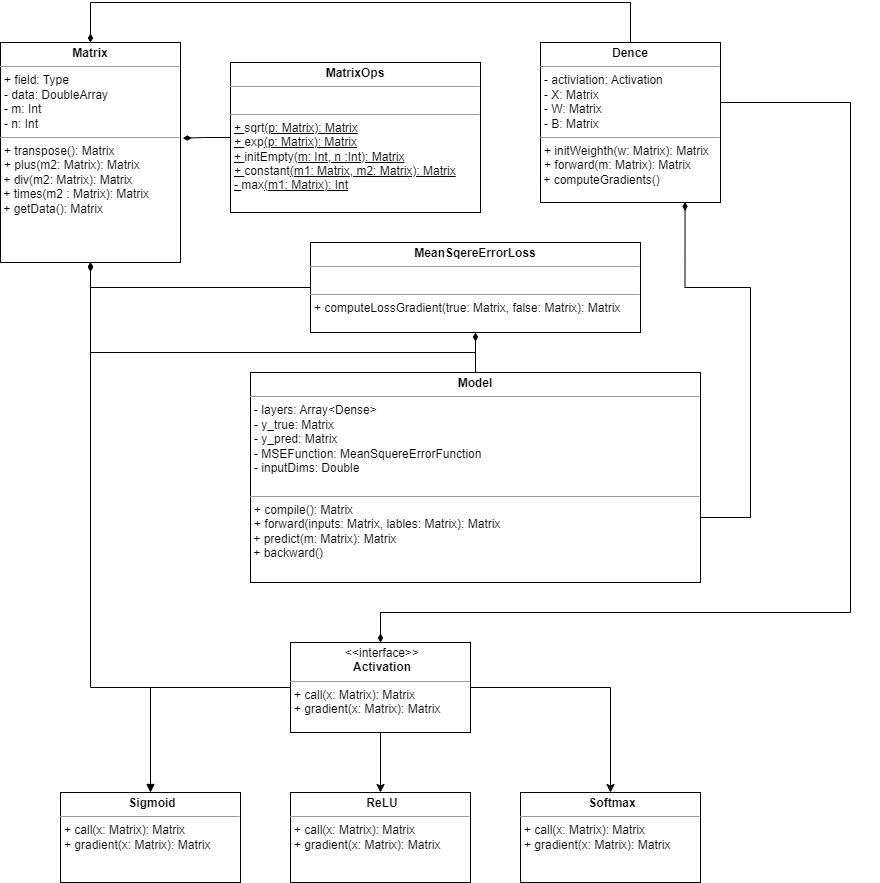
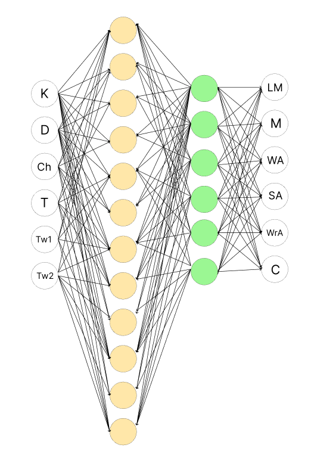
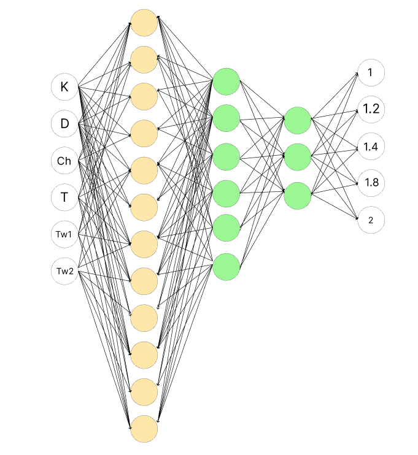
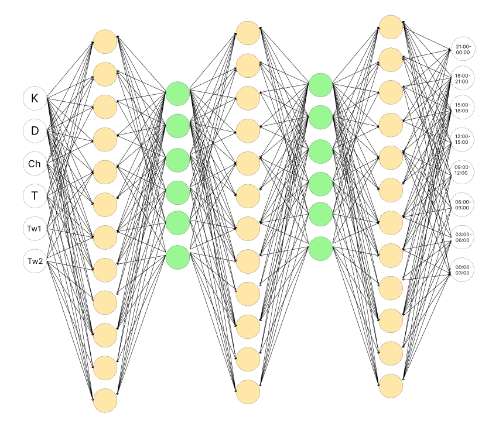
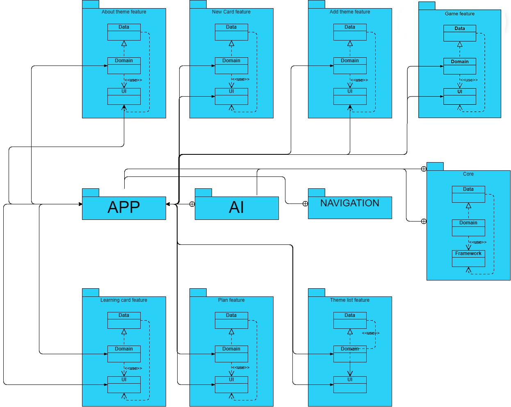

# **Luminous learning**

## **1. Overview.**

In today's information age, we are constantly surrounded by various forms of information. Success isn't merely about understanding a topic; it requires comprehensive knowledge of all aspects related to it. The primary goal of this application is to provide users with the opportunity to enhance their learning speed, allowing them to grasp a wide range of information quickly and effectively, empowering them to thrive in this fast-paced digital era. The Android application centered around personalized learning harnesses the power of a neural network, enabling the creation of a highly tailored and adaptive learning experience for the user.

**Join closed testing** : https://play.google.com/store/apps/details?id=com.lum.memorizable

## **Contents:**

1. [Project Overview](#1-overview)
2. [UML diagram](#2-uml-diagram)
3. [Neural network topologies](#3-to-be-diagram)
4. [Software architecture overview](#4-software-architecture-overview)

## **2. UML diagram:**

The Matrix class is responsible for storing data about a matrix and provides access to auxiliary functions to perform mathematical operations on this matrix. MatrixOps is an auxiliary class with static functions to perform complex mathematical operations on matrices. The Dense class is responsible for performing forward actions on a layer. The Activation interface is an interface that has two functions: 'call' and 'gradient' to perform operations on matrices and calculate gradients. The main class in this context is the Model class, which is responsible for providing a neural network model creation interface for programmers

## **3. Neural network topologies:**

The topology of the neural network for determining the type of mnemonics:

Inputs:

K — Percentage of incorrect results. The information was entered for the last week
D — Percentage of incorrect results. Information entered two or more weeks ago
Ch — Percentage of incorrect results, information does not tend to be remembered
T - Amount of time spent on the test
Tw1 - Average statistical amount of time for which wrong answers were given to questions that do not have a tendency to be remembered
Tw2 - Average statistical amount of time for which correct answers were given to questions that do not have a tendency to be remembered

Outputs:

LM - Miller's law
M — Metacognitive approach
WA - Visual Association Approach
SA — Sound Association Approach
WrA — Descriptive Association Approach
C — Combined approach

The topology of the neural network for determining the determination of the coefficient of interval repetition:

The topology of the neural network for determining the determination of the learning interval :

## **4. Software architecture overview:**

For each feature of our application, 3 modules were created:
UI - contains a description of the visual interface in xml files and the interaction of the interface with other layers of the program. Data-modules contain interfaces of usecases, repositories, and business models.
Domain modules implement interfaces described in the Data layer and provide access to them through the Data layer interfaces.

App module - initializes and configures dependencies between modules and navigation.
Core - describes and initializes the database.
Navigation - describes navigation between modules.
AI - describes artificial intelligence.

